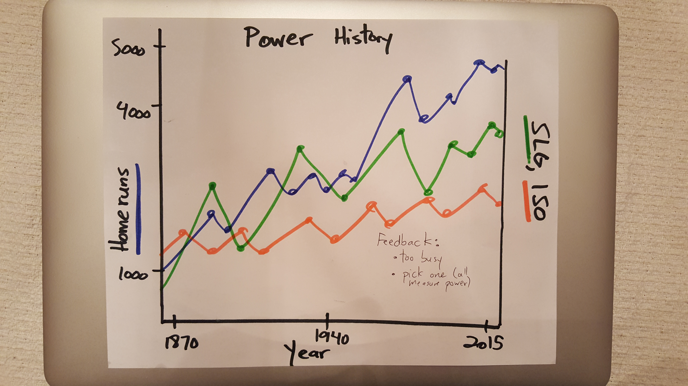
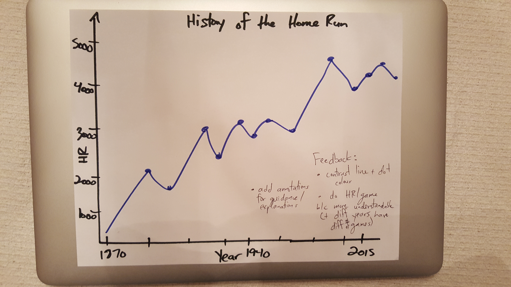
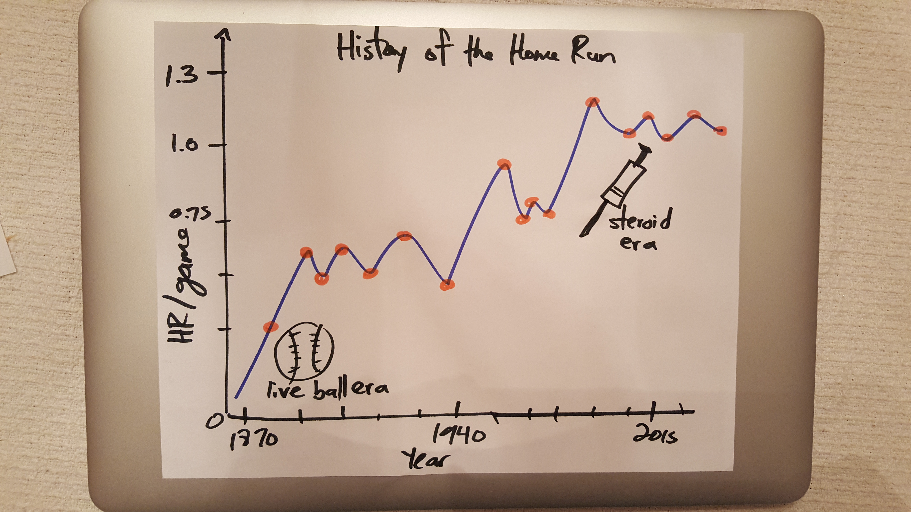

## P6: Make Effective Data Visualization
*Create a data visualization from a data set that tells a story or highlights trends or patterns in the data. Use either dimple.js or d3.js to create the visualization. Your work should be a reflection of the theory and practice of data visualization, such as visual encodings, design principles, and effective communication.*

### Summary
Hitting the ball over the fence is the ultimate manifestation of a hitter's power in baseball. As baseballs, bats, and the bodies of players themselves have evolved over the past 150 years, the amount of home runs per game has trended upwards. Since the number of games per season have changed as well, home runs per game are plotted rather than home runs per season.

### Design
A connected scatter plot (with interactive tooltip via hover) was chosen as the final chart type. The connected line conveys the inherent relationship between successive time-series data points. The data point helps emphasize each year's home runs per game value.

Grey-blue was chosen for the connected line and red was chosen for the circles for contrast purposes. These colour choices were made after receiving feedback that more contrast would help readers pick out the data points from the connected line.

The annotations with pictures are included to guide the reader and help explain the large trends in the data. These were added because of reader feedback as well.

### Feedback
#### Reader 1
The first draft of the visualization was going to cover three statistical measures of hitter power: home runs, slugging percentage, and isolated power. The first reader suggested that the chart was too busy and that perhaps focusing on one measure would make things clearer.

#### Reader 2
Taking the first reader's suggestions into consideration, I chose to focus on home runs - the simplest and most accessible of the statistics. The second reader noted that the y-axis (home runs) should be scaled to home runs per game since the amount of games per season has changed over the years. This was a clear oversight on my part and I quickly incorporated those changes into my design. This change also made the values more digestible and understandable.

#### Reader 3 
Another reader suggested changing the colour of the circles to a different colour than the line to make the data points more distinguishable. This reader also suggested adding annotations to for storytelling purposes.

This next chart ended up being the final product, save for one more annotation. The title was also changed to better frame the upwards trend in home runs that I wished to explain. This sketch was converted to code.

### Resources

- [Baseball Reference dataset](http://www.baseball-reference.com/leagues/MLB/bat.shtml)
- [The evolution of baseball](http://bleacherreport.com/articles/1676509-the-evolution-of-the-baseball-from-the-dead-ball-era-through-today)
- [Steroids in baseball](https://en.wikipedia.org/wiki/Doping_in_baseball)
- [Adding annotations](http://jsfiddle.net/am8ZB/)
- [Loading dataset (Udacity discussion post)](https://discussions.udacity.com/t/why-doesnt-d3-automatically-aggregate-the-numbers-in-this-csv-file/189168/5)

### Review
[Link to review](https://review.udacity.com/#!/reviews/233088)